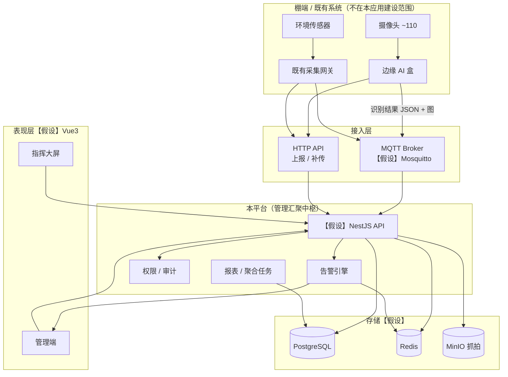
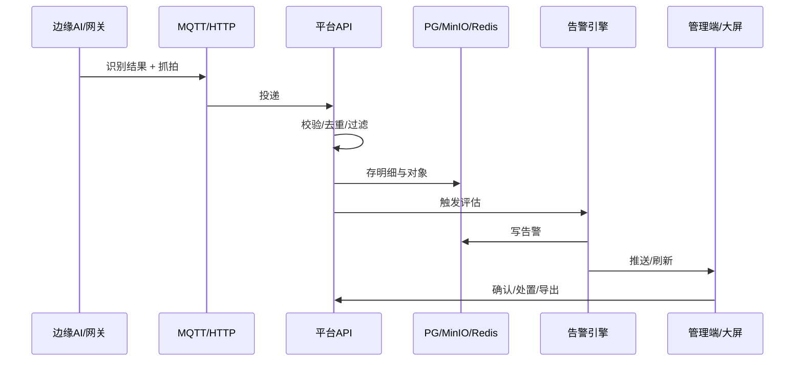
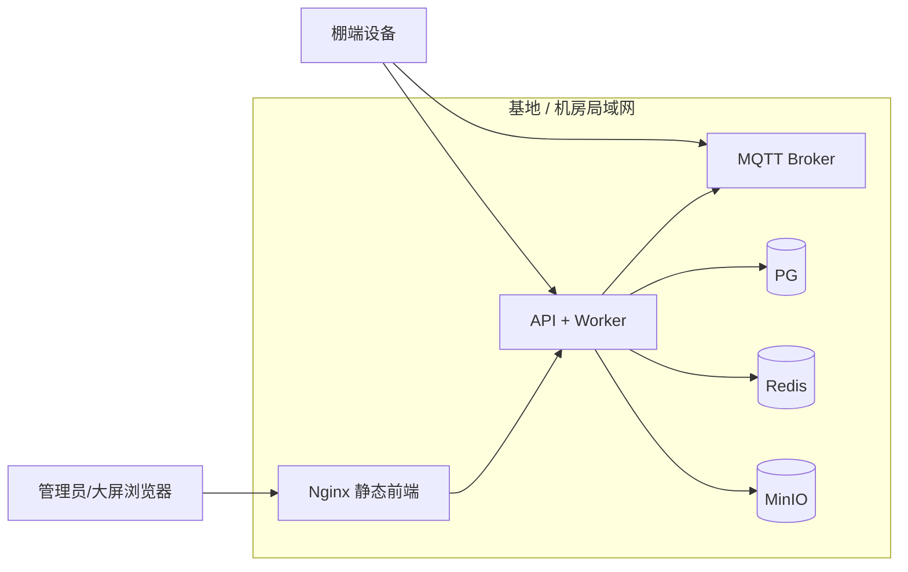

# 技术方案样本（管理汇聚平台）

> 本文为**样本技术方案**，供内部评审与招标附录。文中技术选型均为 **【假设】**，见 `01-假设清单.md`。  
> **非目标**：本应用不包含计算机视觉算法与边缘推理。

---

## 1. 建设目标（一句话）

建设食用菌基地的 **IoT 环境与设备管理 + AI 识别结果汇聚 + 告警闭环 + 采摘/报表 + 农业监控指挥大屏（清亮农作物风格为主，暗色非必须）** 管理中枢，对接既有摄像头 / AI 盒 / 传感器，形成可验收、可分期交付的软件平台。不得按公安 / 雪亮类公共安全系统验收。

---

## 2. 总体架构（【假设】）

---

## 3. 模块划分

| 模块 | 职责 | MVP | 二期 |
|------|------|:---:|:---:|
| 接入与校验 | MQTT/HTTP 收数、鉴权、Schema 校验、去重、断网补传、异常过滤 | ● | 增强 |
| 设备档案 | 摄像头 / AI 盒 / 传感器档案、在线心跳、棚绑定 | ● | 拓扑增强 |
| 告警引擎 | 阈值配置、三级告警、确认处置闭环、站内推送 | ● | 企微/钉钉 |
| 采摘台账 | 当日可采统计、每日采摘清单 | ● | — |
| 报表导出 | 生长/病害/环境/设备/告警 Excel | ● | 模板扩展 |
| 权限审计 | 四角色、棚隔离、登录/操作日志 | ● | — |
| 指挥大屏 | 基地总览、告警墙、抓拍墙、棚平面示意 | 基础可看 | ● 精装 |
| 趋势复盘 | 生长曲线、对比时间轴 | — | ● |
| 病害溯源 | 病害—环境联动查询 | 基础列表 | ● 联动 |
| 产量预估 | 近 2–3 日产量估计 | — | ● |

---

## 4. 数据流（识别结果 → 存储 → 告警 → UI）

1. **边缘侧**完成识别，上报字段（事实口径，细节【假设】可微调）：  
   棚区编号、摄像头编号、识别时间、蘑菇数量、成熟数量、菌盖直径列表/统计、病害数量与等级、抓拍图 URL 或二进制、温湿度、CO₂、基质含水率等。
2. **接入层**经 MQTT Topic 或 HTTP `/ingest/...` 进入；校验签名/Token、时间戳窗口、幂等键去重。
3. **落库**：业务明细 → PostgreSQL；抓拍 → MinIO（路径建议：`棚/日期/摄像头/时间戳`）；热点计数与在线状态 → Redis。
4. **告警引擎**按棚/类型阈值评估，生成三级告警，写入待办；推送站内消息（【假设】MVP）。
5. **UI**：管理端处理闭环与台账；指挥大屏订阅汇总与告警/抓拍流（WebSocket 或短轮询，【假设】）。

---

## 5. 非目标（Non-Goals）

| 明确不做 | 说明 |
|----------|------|
| CV / 模型训练 / 边缘推理 | 识别由既有 IoT/AI 盒完成 |
| 真三维数字孪生 / 倾斜摄影 | 仅平面棚图或拓扑示意 |
| 摄像头/AI 盒硬件供货 | 平台侧软件与对接 |
| ERP / 财务 / 电商 | 超出本管理平台范围 |
| 替代边缘厂商协议私有栈 | 以冻结的开放接口为准 |

---

## 6. 技术栈（全部【假设】）

| 层次 | 选型【假设】 | 用途 |
|------|--------------|------|
| 后端 | NestJS + TypeScript | 业务 API、接入、告警、权限 |
| 前端 | Vue 3 + TS + Vite + Tailwind；清亮农作物监控风格（暗色非必须） | 管理端 + 大屏 |
| 可视化 | ECharts | 曲线、分布、大屏组件 |
| DB | PostgreSQL | 主数据与明细 |
| 缓存 | Redis | 会话、在线、限流、告警队列辅助 |
| 对象存储 | MinIO | 抓拍图 |
| MQTT | Mosquitto | 边缘上行 |
| 部署 | Docker Compose / K8s（二选一，默认 Compose 私有化） | 一键依赖 + 应用 |

> 若甲方强制 Java/Spring 等栈，替换本表并同步假设清单 A06–A10，**不改变业务范围与非目标**。

---

## 7. 安全与 RBAC（【假设】）

- **角色**：系统超管 / 生产管理员 / 棚区负责人 / 只读查看员。  
- **隔离**：所有棚相关查询强制带棚权限过滤；越权返回无数据或 403。  
- **审计**：登录成功/失败、关键配置、告警处置、导出、用户与权限变更均记日志。  
- **传输**：内网 HTTPS（或 TLS 终止于网关）；MQTT 建议 TLS + 设备证书/账号（细节待边缘侧确认）。  
- **密钥**：对象存储与 DB 凭据不入库明文；配置走环境变量/密钥文件。

---

## 8. 部署（【假设】私有化）

- 推荐单机或双机冷备起步；抓拍盘容量按 A17 保留策略估算。  
- 备份：PG 每日逻辑备份 + MinIO 生命周期策略（【假设】）。

---

## 9. 关键风险与样本对策

| 风险 | 对策要点 |
|------|----------|
| 协议未冻结 | 招标要求投标前提供样例报文；合同附件锁版本号 |
| 数据质量差 | 校验、去重、异常过滤、质量看板、误报标记 |
| 告警噪音 | 阈值死区、静默期、合并同类、分级 |
| 产量预估不准 | 二期；依赖历史天数门槛；标明「估计」非承诺产量 |
| 图片膨胀 | 保留天数、压缩约定、冷归档 |

---

## 10. 与招标文档关系

业务强制条款以 `04-招标技术规格书草稿.md` 为准；本文侧重架构说明与【假设】选型展开。
